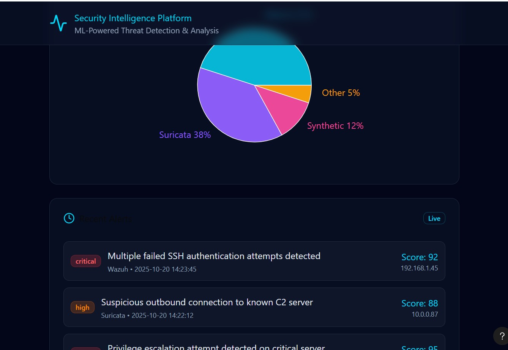

<p align="center">
  
</p>

<h2 align="center">Security Intelligence Platform</h2>
<p align="center"><em>AI-Driven SOC — Wazuh | Suricata | Machine Learning | FastAPI | React</em></p>

---

## 🛠️ Tech Stack <a id="️-tech-stack"></a>

| Layer | Technology |
|-------|------------|
| **Security Data** | Wazuh, Suricata |
| **Storage** | SQLite |
| **Machine Learning** | scikit-learn, imbalanced-learn |
| **API & Backend** | FastAPI, Uvicorn |
| **Frontend** | React, TypeScript, Vite, Tailwind |
| **Deployment** | Docker, Kubernetes (optional) |


---
## 📚 Table of Contents
- [🧠 Overview](#-overview)
- [🛠️ Tech Stack](#️-tech-stack)
- [⚙️ System Architecture](#️-system-architecture)
- [📦 Structure](#-structure)
- [⚙️ Install & Setup Requirements](#️-install--setup-requirements)
  - [🧩 Python Environment (ML + Backend)](#-1️⃣-python-environment-ml--backend)
  - [🖥️ Node.js Environment (Frontend)](#️-2️⃣-nodejs-environment-frontend)
  - [🗄️ Database Initialization](#️⃣-4️⃣-database-initialization)
- [📊 Model Training & Scoring](#️⃣-5️⃣-train-models-rf--brf)
- [🌐 Run API & Dashboard](#️⃣-7️⃣-start-the-api-fastapi)
- [⚙️ Configuration](#️⃣-9️⃣-configuration)
- [🧪 Testing](#️⃣-🔟-testing)
- [📘 Citation](#-citation)
- [📄 License](#-license)


## 🧠 Overview <a id="-overview"></a>
This repository contains the **full implementation** of a Machine-Learning-Powered Security Operations Centre (SOC) designed for real-time threat detection, alert prioritisation, and analyst personalisation.

Built with open-source technologies — **Wazuh**, **Suricata**, **FastAPI**, **SQLite**, and **React + Vite** — the platform demonstrates how AI models such as **Random Forest** and **Balanced Random Forest** can significantly reduce false positives and improve analyst efficiency.
---

## 🚀 Quick Start
### System Requirements
- **OS**: Linux (Ubuntu 20.04+), macOS, or Windows WSL2
- **Python**: 3.8-3.11 (test with specific version)
- **Node.js**: 18.x or 20.x LTS
- **RAM**: Minimum 8GB (16GB recommended for training)
- **Disk**: ~20GB free space
- **SQLite**: 3.31.0+ (usually pre-installed)

```bash
# Clone the repository
git clone https://github.com/yourusername/Thesis.git
cd Thesis
---
```
## ⚡ One-Command Setup <a id="-one-command-setup"></a>
```bash
git clone https://github.com/saurab123456/Thesis.git
cd Thesis
pip install -r soc-ml-pipeline/ml/requirements.txt
python soc-ml-pipeline/ml/training/train_rf_model_random_forest.py
uvicorn api.main:app --host 0.0.0.0 --port 8000
cd src && npm install && npm run dev
```
## ⚙️ System Architecture <a id="️-system-architecture"></a>

  
### 📦 Structure <a id="-structure"></a>
- `soc-ml-pipeline/` — data processing, ML training/scoring, configs  
- `api/` — FastAPI backend  
- `src/` — React dashboard (Vite / TypeScript)  
- `config/` — Wazuh / Suricata configuration and MITRE mappings

### Repository Structure
```bash
Thesis/
├─ api/                      # FastAPI backend (REST endpoints for scores & summaries)
├─ soc-ml-pipeline/
│  ├─ data/                  # DB schema/migrations and processed datasets
│  ├─ ml/                    # Model training/evaluation and model artifacts
│  ├─ scripts/               # Scoring and utility scripts
│  └─ config/                # Field maps, lookups (e.g., MITRE), pipeline config
├─ src/                      # React + TypeScript + Vite frontend dashboard
├─ public/                   # Static assets for the front-end
├─ assets/                   # Images/diagrams (screenshots, pipeline figures)
├─ README.md                 # This documentation
├─ requirements.txt          # Python deps for pipeline/API (if consolidated)
└─ .gitignore                # Excludes live DB files, caches, etc.

```
## ⚙️ Install & Setup Requirements <a id="️-install--setup-requirements"></a>
Before running the SOC pipeline, install all necessary dependencies for both **machine learning** and **API/backend** components.

---

### 🧩 1️⃣ Python Environment (ML + Backend) <a id="-python-environment-ml--backend"></a>
Install required Python libraries for model training, alert scoring, and FastAPI backend.

```bash
pip install -r soc-ml-pipeline/ml/requirements.txt

💡 Tip: create a virtual environment
python3 -m venv venv
source venv/bin/activate

```
### 🖥️ 2️⃣ Node.js Environment (Frontend) <a id="️-nodejs-environment-frontend"></a>

Install dependencies for the React + Vite dashboard (**Node v18+**, **npm 9+**):

```bash
cd src
npm install

```

###  4️⃣ Database Initialization <a id="️-database-initialization"></a>
Initialize SQLite database
Requires sqlite3 installed.

```bash

./soc-ml-pipeline/data/sql/init_db.sh ./datasets/wazuh.db

-- inside sqlite3
.tables
SELECT name, sql FROM sqlite_master WHERE type='table';
```
Generate sample data for testing
Ingest Data (Wazuh / Suricata / Synthetic)

Use your ingestion/processing scripts under soc-ml-pipeline/scripts/ (or data/processing/)
Adjust paths to your raw JSON/NDJSON exports.

```bash
python scripts/generate_sample_data.py

python soc-ml-pipeline/scripts/ingest_wazuh_json_to_sqlite.py \
  --input /path/to/wazuh/json \
  --db ./datasets/wazuh.db

python soc-ml-pipeline/scripts/ingest_suricata_to_sqlite.py \
  --input /path/to/suricata/alerts.json \
  --db ./datasets/wazuh.db

```
### 5️⃣ Model Training & Scoring <a id="-model-training--scoring"></a>
```bash
python soc-ml-pipeline/ml/training/train_rf_model_random_forest.py \
  --db ./datasets/wazuh.db \
  --outdir soc-ml-pipeline/ml/models

python soc-ml-pipeline/ml/training/evaluate_model_metrics.py
```
Artifacts typically produced:

soc-ml-pipeline/ml/models/rf_model.pkl

soc-ml-pipeline/ml/models/rf_model_clean.pkl (optional sanitized)

soc-ml-pipeline/ml/models/feature_columns.pkl

soc-ml-pipeline/ml/models/label_encoder.pkl

soc-ml-pipeline/ml/models/model_metrics.csv (or written to DB table model_metrics)

soc-ml-pipeline/ml/models/model_feature_importance.csv (or DB table model_feature_importance)

### 6️⃣ Score Alerts & Export Summaries

```bash
python soc-ml-pipeline/scripts/score_alerts_with_rf.py \
  --db ./datasets/wazuh.db \
  --model soc-ml-pipeline/ml/models/rf_model.pkl
```
Common tables/views :

wz_scores_rf, wz_scores_brf, wz_scores_if

v_alerts_scored, v_alerts_scored_rf, v_model_scores_union

model_metrics, model_feature_importance

```sql
-- Number of scored alerts
SELECT COUNT(*) FROM wz_scores_rf;

-- Model metrics
SELECT * FROM model_metrics LIMIT 20;

-- Top 10 important features
SELECT * FROM model_feature_importance ORDER BY importance DESC LIMIT 10;
```

### 7️⃣ Run API & Dashboard <a id="-run-api--dashboard"></a>
```bash
cd api
# If you use uvicorn entrypoint like: main:app
uvicorn main:app --host 0.0.0.0 --port 8000 --reload
```
Open: http://localhost:8000/
Docs: http://localhost:8000/docs

### Run the Dashboard (React + Vite)
```bash
cd src
npm run dev
```
Open the printed local URL (e.g., http://localhost:5173) and explore:
```
Real-time scored alerts
Top alert types/severities
Compare Wazuh vs ML scoring (if implemented)
Role-based/analyst-aware views
```
### 9️⃣ Configuration <a id="️-configuration"></a>
Create a .env (or .env.local) based on your settings:
Database
DB_PATH=./datasets/wazuh.db

API
API_HOST=0.0.0.0
API_PORT=8000

Frontend
VITE_API_BASE=http://localhost:8000

### 🔟 Testing <a id="-testing"></a>
Verify Installation
```bash
# Test database
sqlite3 ./datasets/wazuh.db "SELECT COUNT(*) FROM alerts;"

# Test API
curl http://localhost:8000/health

# Test frontend
cd src && npm run build
```
Sample Queries
View scored alerts
```sql
SELECT * FROM v_alerts_scored LIMIT 10;
```
Check model performance
```sql
SELECT model_name, accuracy, precision, recall FROM model_metrics;
```

### Docker Setup

## 🐳 Docker Deployment (Recommended)

### Quick Start with Docker
```bash
# Build and run everything
docker-compose up -d

# Access dashboard at http://localhost:5173
# API docs at http://localhost:8000/docs
```

### Docker Compose
Create `docker-compose.yml`:
```yaml
version: '3.8'
services:
  api:
    build: ./api
    ports:
      - "8000:8000"
    volumes:
      - ./datasets:/app/datasets
    environment:
      - DB_PATH=/app/datasets/wazuh.db
  
  frontend:
    build: ./src
    ports:
      - "5173:5173"
    depends_on:
      - api
```

### Real Data Integration Guide
## 📡 Connecting Real Security Tools

### Wazuh Integration
1. **Export alerts from Wazuh**:
```bash
# On Wazuh manager
/var/ossec/logs/alerts/alerts.json
```

2. **Transfer to pipeline**:
```bash
scp wazuh-server:/var/ossec/logs/alerts/alerts.json ./raw_data/
```

3. **Ingest**:
```bash
python soc-ml-pipeline/scripts/ingest_wazuh_json_to_sqlite.py \
  --input ./raw_data/alerts.json \
  --db ./datasets/wazuh.db
```

### Suricata Integration
Similar steps for `/var/log/suricata/eve.json`

### Citation <a id="-citation"></a>
**Author**: Saurab Kharel 
**Title**: Machine-Learning-Powered SOC Platform  
**Repository**: https://github.com/saurab123456/Thesis  
**Year**: 2024

### MIT License
curl -s https://raw.githubusercontent.com/github/choosealicense.com/gh-pages/_licenses/mit.txt \
  | sed "s/\[year\]/2025/; s/\[fullname\]/Saurab Kharel/" > LICENSE
git add LICENSE && git commit -m "Add MIT license" && git push

